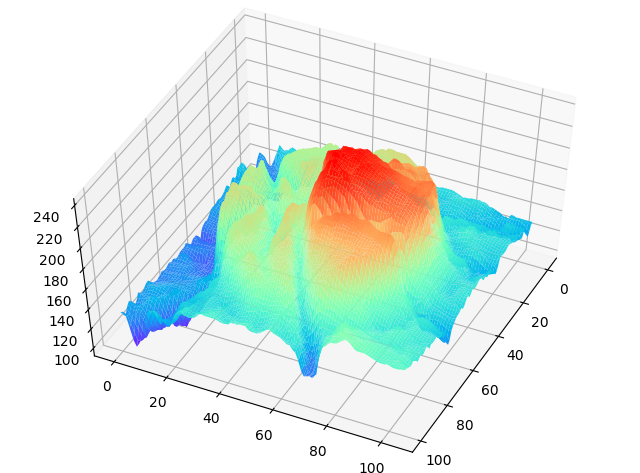

# 3D Gray Image Visualization Tool

This tool is to help visualize gray image.For example, the following image is a gray patch of optic disc.

My tool can convert the gray patch to interactive 3D image with matplotlib.

